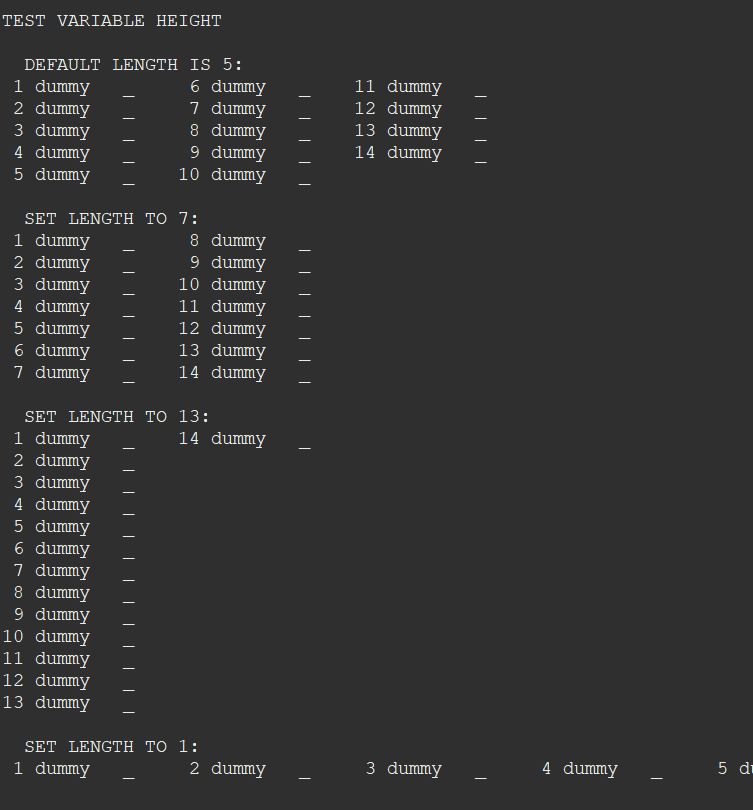

# Multi-Column-List

This code is a project which is part of a larger project and includes two Java classes: MultiColList.java and ListDemo.java. The main purpose of this code is to create a nicely formatted multi-column list and demonstrate its functionalities through ListDemo.java. My plan was to use this in my own handmade CLI to display a list of tasks and deadlines in the main menu. The MultiColList class represents the multi-column list and employs severa OOP concepts to manage and manipulate the list data.

Object-Oriented Programming Concepts Used:

1. **Constructor Overloading**: The MultiColList class has two constructors - a default constructor and a parameterized constructor that accepts variable arguments (String... items).

2. **Encapsulation**: The class has encapsulated its fields, making them private and providing public methods to access and modify the properties like setVertical, setItem, setStatus, add, remove, and clear.

3. **Polymorphism**: The add method in MultiColList.java demonstrates method polymorphism. It is overloaded to accept both a single string item and an array of string items, adding them to the list.

4. **Builder Pattern**: The MultiColList class employs the builder pattern in its add method. The add method returns the current instance of the MultiColList object, allowing for method chaining. For example, list.add("item1").add("item2") adds "item1" and "item2" to the list in a single statement.

5. **Variable Arguments Parameter**: The parameterized constructor of MultiColList.java takes a variable number of string arguments (String... items), enabling the user to create a multi-column list with a variable number of items.

6. **Composition**: The MultiColList class includes an ArrayList of strings (items) and an ArrayList of characters (status). These ArrayLists are used to store the items and status of each list item, respectively.

7. **Method Override**: The MultiColList class overrides the toString method to provide a string representation of the multi-column list. It formats the list items and status in columns, ensuring alignment and readability.

ListDemo.java demonstrates the functionality of the MultiColList class by creating instances of MultiColList and showcasing its capabilities. The code tests various scenarios, such as adding items, removing items, setting vertical size, and clearing the list.

Overall, the MultiColList class is a versatile and reusable component that can be utilized in the larger project to manage and display data in a multi-column list format.
